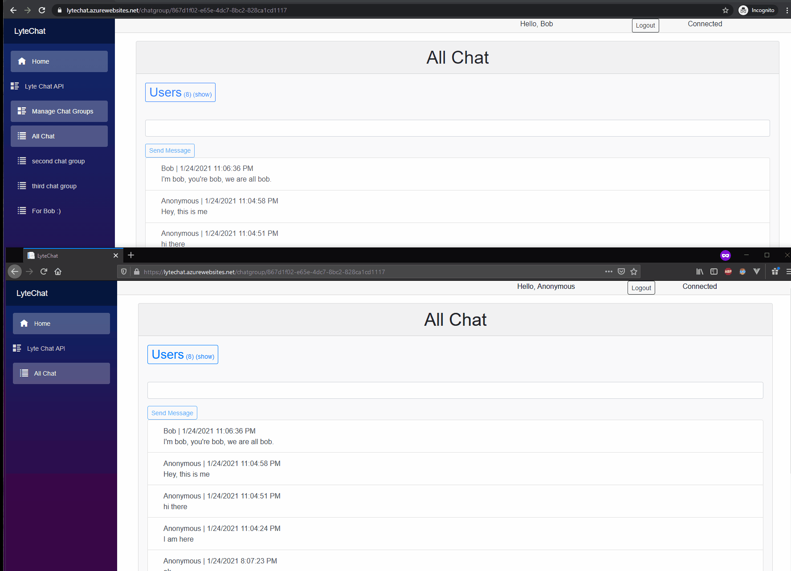

# LyteChat

<h2>Deployed Link </h2>

<h3>Website https://lytechat.azurewebsites.net/ </h3>
<h3>REST API https://lytechat.azurewebsites.net/swagger/index.html </h3>

<h3> Demo </h3>

<h2>About </h2>

 Real time secure web chat application. Includes Blazor web client and REST API. 

<h2>Description </h2>

 TODO. 

<h2>Technologies</h2>
<ul>
  <li> C# </li>
  <li> ASP.NET Core 5 </li>
  <li> MySQL </li>
  <li> Entity Framework</li>
  <li> SignalR </li>
  <li> Protected API and chat hub authentication using JSON Web Tokens </li>
  <li> Blazor </li>
  <li> Bootstrap </li>

 </ul>
 
 <h2> Future Improvements </h2>
 <ul>
    <li> General UI enhancements </li>
    <li> Improve mobile responsiveness </li>
    <li> Edit chat message/chat group functionality</li>
    <li> Add voice streaming for chat groups</li>
  </ul>
